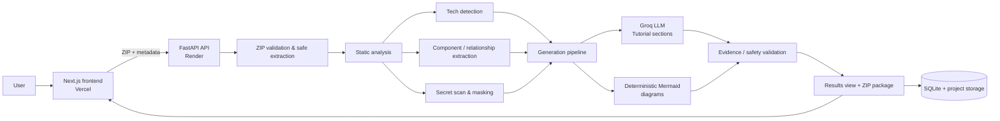

# Repox

Repox turns an uploaded repository ZIP into a tailored, evidence-graded codebase tour. Users provide a product description, the features they want explained, and an audience level (`beginner`, `product`, or `developer`). Repox detects the stack, maps components and relationships, scans for secrets, writes an LLM-assisted tutorial, generates Mermaid diagrams, and packages the result as a downloadable ZIP.

## Submission links

| Deliverable | Location |
| --- | --- |
| Source repository | [github.com/Vedant24v/Repox](https://github.com/Vedant24v/Repox) |
| Frontend deployment | [repox-alpha.vercel.app](https://repox-alpha.vercel.app) |
| Backend deployment | [repox-api.onrender.com](https://repox-api.onrender.com/health) |
| User-journey recording | _Add the Loom or video URL after recording_ |
| Sample raw analysis | [`samples/taskflow/analysis/`](samples/taskflow/analysis/) and [`samples/indus-mind/analysis/`](samples/indus-mind/analysis/) |
| Sample explanation ZIPs | [`samples/taskflow/repotutor_output.zip`](samples/taskflow/repotutor_output.zip) and [`samples/indus-mind/repotutor_output.zip`](samples/indus-mind/repotutor_output.zip) |

The included samples are end-to-end runs on two personal projects: **TaskFlow**, a MERN task-management web app, and **Indus Mind**, an AI/RAG application. Their detected stacks and generated output differ accordingly.

## System architecture



### Pipeline

1. The frontend uploads a `.zip` with optional product context, requested features, and an audience level.
2. FastAPI validates and safely extracts it, then inventories files while skipping dependency/build directories.
3. Static passes identify technologies, important files, imports/routes/API relationships, and likely credentials.
4. The generator uses the collected evidence and audience setting to create nine Markdown tutorial sections. Mermaid architecture, user-flow, repository-map, and (when applicable) ERD diagrams are produced deterministically.
5. Validation checks output references and secret handling, then Repox exposes the interactive result and a packaged ZIP.

## Supported technologies

Detection is heuristic and covers common project markers and source patterns, including:

- JavaScript, TypeScript, Python, Java, Go, Ruby, PHP, C#, Rust, HTML, CSS, and SQL.
- React, Next.js, Vue, Angular, Vite, Node.js/Express, FastAPI, Django, Flask, Spring, and common API routes.
- MongoDB/Mongoose, PostgreSQL, MySQL, Prisma, Sequelize, SQLAlchemy, Docker, and Docker Compose.
- OpenAI/Groq-style integrations, LangChain-related packages, vector-store/RAG signals, and environment-based configuration.

## Local setup

### Prerequisites

- Python 3.11+
- Node.js 18+
- A Groq API key for LLM-generated tutorial prose (static analysis still works without one)

### Backend

```bash
cd backend
python -m venv .venv
# Windows
.\.venv\Scripts\Activate.ps1
# macOS/Linux: source .venv/bin/activate
pip install -r requirements.txt
Copy-Item .env.example .env  # macOS/Linux: cp .env.example .env
uvicorn app.main:app --reload --port 8000
```

### Frontend

```bash
cd frontend
npm install
Copy-Item .env.example .env.local  # macOS/Linux: cp .env.example .env.local
npm run dev
```

Open `http://localhost:3000`, upload a repository ZIP, set the optional context, select an audience level, wait for analysis, then generate and download the explanation package.

## Environment configuration

Copy the repository-level [`.env.example`](.env.example) into `backend/.env` and `frontend/.env.local`, then use only the variables needed by each service. Do not commit real keys.

## Deployment

### Backend on Render

1. Create a new Render **Web Service** from this repository.
2. Set the service root directory to `backend`.
3. Use build command `pip install -r requirements.txt` and start command `uvicorn app.main:app --host 0.0.0.0 --port $PORT`.
4. Add `GROQ_API_KEY`, `GROQ_MODEL` (optional), `STORAGE_DIR=storage`, and `CORS_ORIGINS` (the Vercel URL).
5. Verify `<render-url>/health` returns `{"status":"ok"}`.

### Frontend on Vercel

1. Import this repository and set the root directory to `frontend`.
2. Add `NEXT_PUBLIC_API_URL=https://<your-render-service>.onrender.com`.
3. Deploy, then add the Vercel URL to the backend `CORS_ORIGINS` and redeploy the backend.

## Sample artifacts

Each sample directory includes the raw analysis artifacts (`tech.json`, `important_files.json`, `relationships.json`, and `secrets_report.json`) plus the generated `repotutor_output.zip`. The ZIP contains nine Markdown sections, Mermaid diagrams, an output README, the explanation plan, tech summary, and validation report.

## Known limitations

1. Analysis is heuristic/regex-based rather than AST-based, so dynamic imports, reflection, generated code, and unusual conventions can be missed.
2. LLM prose depends on the configured provider and can be rate-limited or occasionally need human review despite evidence grading.
3. Local filesystem/SQLite storage is appropriate for a demo; ephemeral Render instances can lose completed projects after restart. Production needs persistent object storage and a managed database.
4. Very large ZIPs are processed in-process and may exceed memory, timeout, or free-tier constraints.
5. Secret detection is a defensive pattern scan, not a guarantee that every sensitive value is found or fully redacted.
